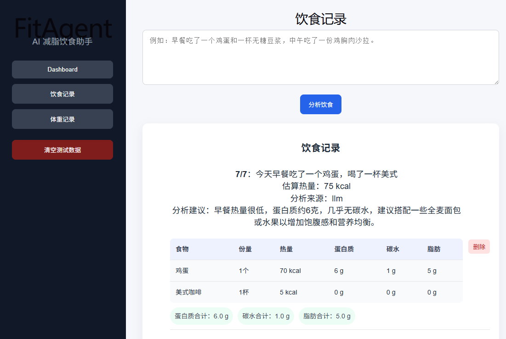

# FitAgent

FitAgent 是一个面向减脂用户的 AI 饮食记录与体重趋势分析网页应用。

用户可以通过自然语言记录每日饮食，系统会自动估算热量，并结合体重记录生成趋势图和每日减脂建议。项目目标是帮助减脂用户更轻松地记录饮食、理解体重变化，并获得可执行的调整建议。

## 在线 Demo

https://eloquent-klepon-56c57f.netlify.app

## 项目背景

在减脂过程中，很多用户会遇到以下问题：

- 每天饮食记录麻烦，难以长期坚持
- 食物热量估算困难，容易低估摄入
- 体重短期波动容易造成焦虑
- 不知道如何根据体重变化调整饮食

FitAgent 希望通过 AI Agent 的方式，把饮食记录、热量估算、趋势分析和每日建议整合到一个简单的网页应用中。

## 当前版本功能

- Dashboard 首页
- 饮食记录页面
- 体重记录页面
- 今日摄入热量展示
- 体重趋势展示
- AI 每日建议展示

## 技术栈

- React
- Vite
- JavaScript
- CSS

## 后续计划

- 接入后端 API
- 接入 AI 模型进行饮食文本解析
- 添加数据库保存饮食和体重记录
- 添加真实图表展示
- 增加体重趋势预测功能

- ## 项目截图

